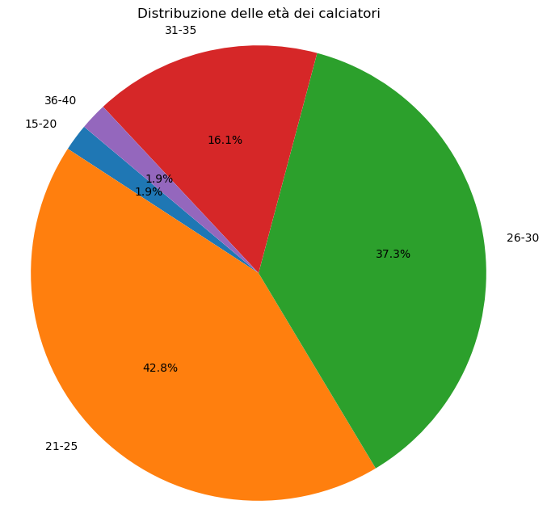
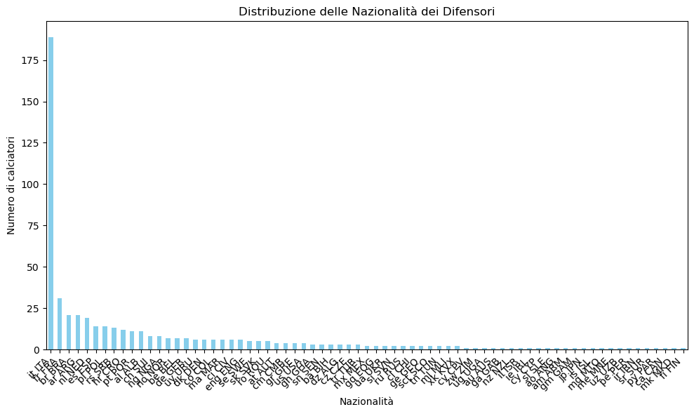

# Serie A Player Profiling & Longitudinal Analytics
### Exploratory Data Science, Role Metrics, and Multi-Season Scouting in Python

[](https://www.python.org/)
[]()
[]()
[]()

> **Author**: **Alessandro Castellani**  
> *Undergraduate background in Mathematics (Università dell'Insubria) | Graduate coursework in Applied Statistics & Data Science (Università Cattolica del Sacro Cuore)*  
> 📬 [alecaste041202@gmail.com](mailto:alecaste041202@gmail.com) | 🔗 [LinkedIn Profile](https://www.linkedin.com/in/alessandro-castellani/) | 🐙 [GitHub Profile](https://github.com/Alecaste96)

---

## 📌 Project Overview

This repository contains an end-to-end exploratory and scouting analytics suite focused on **Italian Serie A players**. Using granular event and seasonal data, the project covers:
1. **Demographic & Squad Composition**: Analysis of squad age structures, youth integration (Under-23 vs. veterans), and foreign player distribution across clubs.
2. **Positional Metric Correlations**: Identifying interdependent KPIs for forwards (goal threat, box occupancy, creation) and goalkeepers (saving efficiency, cross-prevention).
3. **Longitudinal Defender Tracking (2019–2023)**: A multi-season tracking study of Serie A defenders over five consecutive seasons, evaluating defensive output, pressing efficiency, and ball progression.

---

## 📂 Repository Structure & Notebooks

| # | Notebook | Focus Area | Key Metrics & Methods |
|---|---|---|---|
| **01** | [`01_demographics_and_squad_composition.ipynb`](./01_demographics_and_squad_composition.ipynb) | Squad Structure & Demographics | Age bracket distribution, nationality share, average squad age per club. |
| **02** | [`02_forwards_correlation_analysis.ipynb`](./02_forwards_correlation_analysis.ipynb) | Forward Profiling & KPI Correlation | Interactive Plotly correlation matrices between shots, expected goals, touches, and progressive passes. |
| **03** | [`03_goalkeepers_correlation_analysis.ipynb`](./03_goalkeepers_correlation_analysis.ipynb) | Goalkeeper Shot-Stopping & Distribution | Post-shot xG differentials, save percentages, launching accuracy, and penalty-box command. |
| **04** | [`04_defenders_analysis_2019.ipynb`](./04_defenders_analysis_2019.ipynb) to [`...2023.ipynb`](./04_defenders_analysis_2023.ipynb) | Longitudinal Defender Scouting (5 Seasons) | Multi-year tracking of tackles won, aerial duel win rates, defensive third recoveries, and progressive carries. |
| **05** | [`05_longitudinal_league_trends.ipynb`](./05_longitudinal_league_trends.ipynb) | Macro League Trends | League-wide evolution of pressing intensity, passing pace, and age trends. |

---

## 📊 Sample Visualizations

### 1. League-Wide Age Distribution & Cohorts
Stratifying players into career phases highlights squad renewal strategies and developmental bottlenecks across Italian clubs.

<p align="center">
  
</p>

### 2. Internationalization & Nationality Representation
Tracking foreign vs. domestic player quotas to analyze international scouting reach across Serie A organizations.

<p align="center">
  
</p>

---

## 🛠️ Environment & Requirements

To explore the notebooks locally:

```bash
git clone https://github.com/Alecaste96/serie-a-player-profiling-python.git
cd serie-a-player-profiling-python
pip install pandas numpy matplotlib seaborn plotly openpyxl
jupyter notebook
```

---

## 📬 Contact & Opportunities

I am actively seeking **internship and analytical collaboration opportunities** within professional football clubs, sports tech organizations, and governing bodies (UEFA / FIFA).

- **Email**: [alecaste041202@gmail.com](mailto:alecaste041202@gmail.com)
- **LinkedIn**: [linkedin.com/in/alessandro-castellani](https://www.linkedin.com/in/alessandro-castellani/)
- **GitHub**: [github.com/Alecaste96](https://github.com/Alecaste96)
